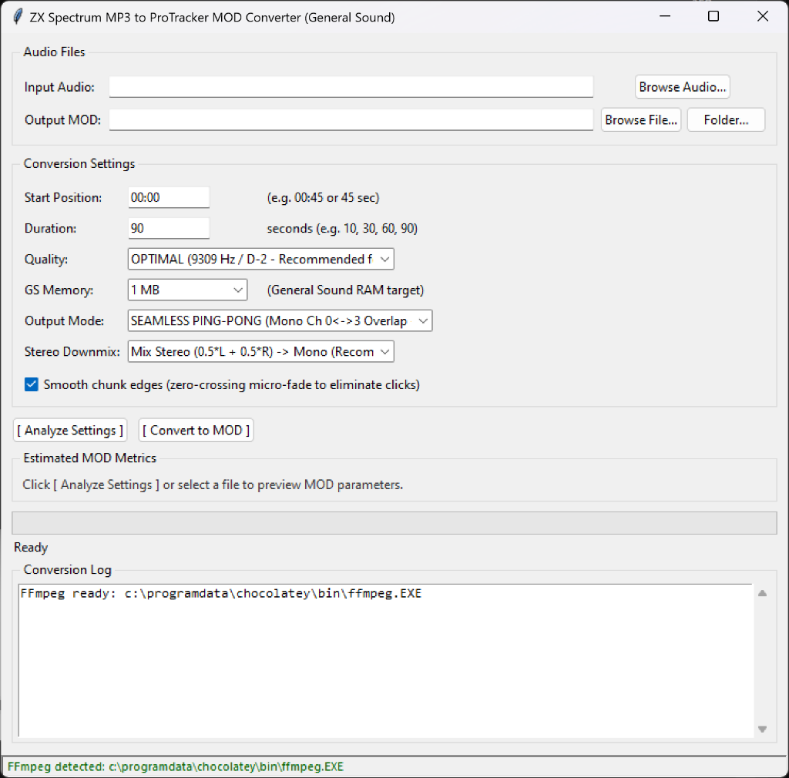

# ZX Spectrum MP3 to ProTracker MOD Converter (General Sound)

[](https://www.python.org/)
[](https://www.microsoft.com/windows)
[](https://en.wikipedia.org/wiki/General_Sound)
[](https://en.wikipedia.org/wiki/MOD_(file_format))
[](LICENSE)
[](https://github.com/dejanoff/ZX_MP3_MOD/releases/tag/v1.1.0)
[](https://github.com/dejanoff/ZX_MP3_MOD/releases/latest)

Специализированный конвертер современных аудиофайлов (**MP3, WAV, FLAC, OGG, M4A**) в классический 4-канальный трекерный формат **ProTracker MOD** (`M.K.`), оптимизированный в первую очередь для аппаратного воспроизведения на ретро-компьютере **ZX Spectrum** с звуковой картой **General Sound (GS)** через плеер **Wild Player**.

<p align="center">
  
</p>

---

## 📥 Скачать готовую программу (Windows EXE)

Для запуска программы **не требуется** устанавливать Python:

👉 **[Скачать MP3toMOD.exe (Windows 64-bit, v1.1.0)](https://github.com/dejanoff/ZX_MP3_MOD/releases/download/v1.1.0/MP3toMOD.exe)** *(~11 МБ)*  
*(Все релизы и обновления доступны на странице [GitHub Releases](https://github.com/dejanoff/ZX_MP3_MOD/releases))*

> ⚠️ **Важно**: Для декодирования аудиоформатов (MP3, FLAC, OGG, M4A и др.) программе требуется **FFmpeg**. Скачайте `ffmpeg.exe` (например, с [gyan.dev](https://www.gyan.dev/ffmpeg/builds/)) и положите его в ту же папку рядом с `MP3toMOD.exe`.

---

## 💡 Главная идея проекта

Конвертер **НЕ** пытается распознавать мелодию, **НЕ** снимает ноты и **НЕ** делает обычный трекерный ремикс.

Формат **ProTracker MOD** используется в качестве **контейнера для потокового PCM-звука**:
1. Исходное аудио декодируется с помощью **FFmpeg** и микшируется в моно (`signed 8-bit PCM`).
2. Поток ресемплируется в строго рассчитанную аппаратную частоту воспроизведения чипа **Amiga Paula / General Sound**, привязанную к стандартным нотным периодам трекера (например, нота `D-2` с периодом `381` $\approx$ `9309.44 Гц`).
3. Непрерывный звук нарезается на длинные сэмплы (до 31 шт.), размер которых строго согласован со скоростью воспроизведения паттернов трекера (64 строки паттерна при `Speed=6, BPM=125` дают ровно `7.68` секунды).
4. Создается трекерная партитура паттернов, которая последовательно переключает и воспроизводит эти сэмплы.
5. На выходе получается 100% валидный файл **ProTracker MOD** (`M.K.`), который без проблем открывается в **Wild Player** на **ZX Spectrum + General Sound**, а также в любом эмуляторе и современном трекере (OpenMPT, MilkyTracker).

---

## 🚀 Ключевые возможности

### 🏓 1. Бесшовный режим переключения: Seamless Ping-Pong Overlap (Устранение заиканий)
При обычном последовательном воспроизведении сэмплов на одном канале звуковая карта General Sound (Z80) тратит время на остановку и повторную инициализацию DMA-указателей на стыке паттернов, что приводило к щелчкам и микро-паузам ("запинаниям").

Режим **SEAMLESS PING-PONG** решает эту проблему на аппаратном уровне:
- **Безопасная нарезка по 32 строки (3.84 сек):** исключает аппаратное переполнение 16-битных регистров процессора Z80 на плате General Sound. При частоте 9 309 Гц сэмпл весит всего ~36 КБ (вместо прежних 72 КБ), гарантированно укладываясь в системный лимит 64 КБ ($65\,534$ байта).
- **Чередование каналов (Ch 0 <-> Ch 3):** в классической Amiga каналы 0 и 3 **оба физически выведены в левый канал** (`Left`). При переключении между ними стереопанорама остаётся неподвижной.
- **Нахлёст и кроссфейд (1 строка = 120 мс):** каждый сэмпл нарезается с запасом в 1 дополнительную строку ($32 + 1 = 33$ строки). Хвост уходящего сэмпла плавно затухает ($1.0 \to 0.0$), а голова нового сэмпла плавно нарастает ($0.0 \to 1.0$). Сумма громкостей всегда строго равна $1.0$.
- **Аппаратная фиксация темпа (`F06` и `F7D`):** на строке 0 первого паттерна жестко прописываются команды Speed 6 (`F06`) и BPM 125 (`F7D`), что блокирует рассинхрон таймера на клонах ZX Spectrum (например, Pentagon 128 с развёрткой 49.88 Гц).
- **Немая петля зацикливания (Silent Loop Buffer):** в конец каждого сэмпла добавляется буфер тишины, куда выставляется точка зацикливания (`repeat_offset`). Это гарантирует 100% тишину вместо резкого зуда Paula при любых задержках.
- **Автоматизация команд громкости (`C40` и `C00`):** новый сэмпл запускается на полной громкости (`C40`), а через 120 мс отзвучавший канал моментально глушится (`C00`), освобождая ресурсы звуковой карты.
- **Минимальная нагрузка:** 98.4% времени играет ровно 1 канал, исключая перегрузку процессора Z80 звуковой карты.

### 🎚 2. Микширование стерео в моно (Stereo Downmix)
- **Mix Stereo (0.5\*L + 0.5\*R):** полноценный стерео-микс без потери партий инструментов левого или правого каналов.
- **Left Channel Only / Right Channel Only:** возможность изолировать один конкретный канал исходной дорожки.

### 💾 3. Умный контроль памяти General Sound (RAM Budgeting)
- Поддержка конфигураций памяти GS: **512 KB**, **1 MB** (стандарт), **2 MB**, **4 MB**, **Unlimited**.
- Режим качества **AUTO** автоматически выбирает максимально возможную частоту дискретизации, которая впишется в указанный объем памяти General Sound и уложится в 31 сэмпл.
- Предварительный анализ (`Analyze`) позволяет заранее увидеть размер файла и количество сэмплов до конвертации.

### 📂 4. Раздельное запоминание папок и авто-именование
- Входная папка с музыкой и выходная папка экспорта MOD запоминаются раздельно в `config.json`.
- Автоматическая транслитерация кириллических названий в безопасную латиницу (например, `Ворона - Кэнни` $\to$ `Vorona_Kenni`).
- Автоматическое добавление настроек в имя файла и нумерация при повторном экспорте:  
  `Vorona_Kenni_9309Hz_pingpong_60s.mod` $\to$ `Vorona_Kenni_9309Hz_pingpong_60s_01.mod`.

### 🛡 5. Встроенная бинарная валидация
Каждый файл проверяется строгим внутренним валидатором стандарта ProTracker:
- Сигнатура заголовка: строго `M.K.` (offset 1080).
- Размер заголовка: ровно 1084 байта.
- Количество сэмплов: до 31 с выравниванием по четным байтам (16-битные слова).
- Безопасные не зацикленные параметры петли (`repeat_offset=0, repeat_length=1`) для предотвращения аппаратного зависания Paula.
- Размер каждого паттерна: ровно 1024 байта (64 строки $\times$ 4 канала $\times$ 4 байта).

---

## 📊 Таблица частот дискретизации

Частоты вычислены по формуле тактовой частоты PAL Paula:
$$\text{Frequency} = \frac{3\,546\,895}{\text{Period}}$$

| Пресет | Нота | Период | Частота (Гц) | Описание |
|---|:---:|:---:|:---:|---|
| **OPTIMAL** ⭐ | **D-2** | **381** | **9 309 Гц** | **Рекомендуемый для GS.** Идеальный баланс качества, размера и стабильности. |
| **NORMAL** | C-2 | 428 | 8 287 Гц | Классический базовый тон трекерных сэмплов. |
| **LOW** | G-1 | 570 | 6 223 Гц | Для длинных треков (до 230 сек) или плат GS с 512 КБ RAM. |
| **HIGH** | F-2 | 320 | 11 084 Гц | Повышенная четкость (для эмуляторов или быстрых систем). |
| *C#2* | C#2 | 404 | 8 779 Гц | Промежуточная частота. |
| *D#2* | D#2 | 360 | 9 852 Гц | Промежуточная частота. |
| *E-2* | E-2 | 339 | 10 463 Гц | Промежуточная частота. |
| **AUTO** | — | — | Динамически | Автоматический подбор лучшего качества под лимит памяти. |

---

## 🛠 Установка и требования

### Требования
1. **Windows 10 / 11** (64-bit).
2. **FFmpeg**: утилита `ffmpeg.exe` должна находиться в папке с программой или в системном `PATH`.
   - Если FFmpeg не установлен, скачайте сборку с [gyan.dev](https://www.gyan.dev/ffmpeg/builds/) и положите `ffmpeg.exe` рядом с программой.

### Запуск из исходного кода
```bash
# Клонирование репозитория
git clone https://github.com/dejanoff/ZX_MP3_MOD.git
cd ZX_MP3_MOD

# Установка зависимостей (только стандартная библиотека Python + PyInstaller для сборки)
pip install -r requirements.txt

# Запуск графического интерфейса
python mp3tomod.py
```
Либо дважды кликните по `run.bat`.

---

## 🖥 Графический интерфейс (GUI)

Запустите `python mp3tomod.py` (или `run.bat` / скомпилированный `MP3toMOD.exe`):

1. **Input Audio:** выберите исходный файл (`.mp3`, `.wav`, `.flac`, `.ogg`, `.m4a`).
2. **Output MOD:** задайте имя выходного файла или папку экспорта через кнопку **Folder...**.
3. **Start Position:** время начала трека (в секундах или `MM:SS`, например `00:30`).
4. **Duration:** длительность фрагмента в секундах (например, `60`).
5. **Quality:** выберите качество (по умолчанию `OPTIMAL 9309 Hz`).
6. **GS Memory:** целевой объем памяти General Sound (`1 MB`, `512 KB`, `2 MB`, `4 MB`, `Unlimited`).
7. **Output Mode:**
   - `SEAMLESS PING-PONG (Mono Ch 0<->3 Overlap)` ⭐ — бесшовный режим без щелчков и заиканий.
   - `ONE CHANNEL (Sequential on Ch 0)` — последовательное моно на 0-м канале.
   - `CENTERED (Dual channel Left + Right)` — стерео по центру (одновременно каналы 0 и 1).
8. **Stereo Downmix:** выберите `Mix Stereo (0.5*L + 0.5*R) -> Mono`.
9. Нажмите **[ Analyze Settings ]** для предварительной проверки параметров.
10. Нажмите **[ Convert to MOD ]** для выполнения конвертации.

---

## 💻 Использование через командную строку (CLI)

```bash
# Базовый запуск с рекомендуемыми настройками (Ping-Pong, 9309 Гц, микс в моно, 60 сек):
python mp3tomod.py song.mp3 --start 00:30 --duration 60 --quality OPTIMAL --mode ping_pong --downmix mix

# Конвертация под 512 КБ General Sound с качеством LOW:
python mp3tomod.py song.mp3 output.mod --start 45 --duration 60 --quality low --memory 512k

# Только предварительный расчет и проверка параметров (--analyze):
python mp3tomod.py song.mp3 --start 0 --duration 90 --analyze

# Запуск встроенного самотестирования без внешних файлов:
python mp3tomod.py --selftest
```

### Параметры CLI:
| Параметр | Сокращение | Описание | По умолчанию |
|---|:---:|---|:---:|
| `input` | — | Путь к входному аудиофайлу | — |
| `output` | — | Путь к выходному MOD-файлу (при пропуске генерируется автоматически) | `<auto>` |
| `--start` | `-s` | Начало фрагмента в секундах или `MM:SS` | `0` |
| `--duration` | `-d` | Длительность фрагмента в секундах | `60` |
| `--quality` | `-q` | Пресет качества (`OPTIMAL`, `NORMAL`, `LOW`, `HIGH`, `AUTO` или Гц) | `OPTIMAL` |
| `--memory` | `-m` | Лимит памяти GS (`512k`, `1m`, `2m`, `4m`, `unlimited`) | `1m` |
| `--mode` | `-o` | Режим каналов: `ping_pong`, `one_channel`, `centered` | `ping_pong` |
| `--downmix` | — | Режим сведения стерео: `mix`, `left`, `right` | `mix` |
| `--title` | `-t` | Название трека в MOD заголовке (до 20 символов) | Имя файла |
| `--no-smooth` | — | Отключить сглаживание переходов | Выключено |
| `--analyze` | — | Анализ ресурсов без создания файла | Выключено |
| `--selftest` | — | Автономный самотест конвертера с проверкой валидности | Выключено |
| `--gui` | — | Принудительный запуск графического окна | — |

---

## 📦 Сборка автономного EXE (PyInstaller)

Для сборки одного независимого `.exe` файла запустите:

```bat
build.bat
```

Или вручную через терминал:
```bash
pyinstaller --noconfirm --clean --onefile --noconsole --name "MP3toMOD" mp3tomod.py
```

Готовый файл появится в папке `dist\MP3toMOD.exe`. Он не требует установленного Python и готов к распространению.

---

## 🧪 Тестирование

Проект полностью покрыт модульными тестами (27 тестов):
```bash
python -m unittest discover -s tests -v
```

Тесты проверяют:
- Точность математики таймингов и частот Paula (`PAL_CLOCK = 3546895.0`).
- Кодирование и декодирование 4-байтовых ячеек ProTracker.
- Упаковку заголовков сэмплов и паттернов.
- Корректность кроссфейда и сглаживания краев.
- Работу режима Ping-Pong (чередование каналов 0 и 3, команды `C40` и `C00`).
- Защиту от поврежденных сигнатур и усеченных файлов.
- Транслитерацию кириллицы и автонумерацию файлов.

---

## 📼 Воспроизведение на ZX Spectrum

1. Скопируйте полученный `.mod` файл на SD-карту (для контроллеров **DivMMC**, **Z-Controller**, **Nemo IDE**) или запишите в TR-DOS образ.
2. Вставьте носитель в ZX Spectrum с подключенной платой **General Sound**.
3. Запустите плеер **Wild Player** (by Alone Coder / DimkaM).
4. Выберите файл `.mod` и нажмите ввод. Wild Player загрузит сэмплы в память General Sound и начнет воспроизведение.

---

## 📄 Лицензия

Проект распространяется под свободной лицензией **MIT**. Подробности в файле [LICENSE](LICENSE).

Автор: **Oleg Skuratovskiy** ([@dejanoff](https://github.com/dejanoff))
